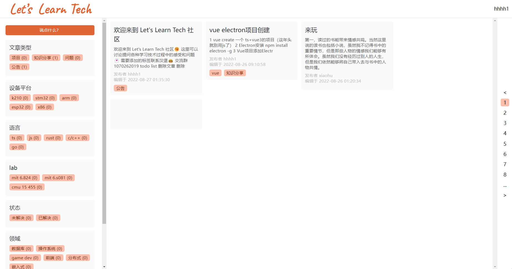

# LearnTechTogether

使用Rust和React开发的交流社区平台

## 技术栈

前端：`React`

后端: `Rust`（`axum` ）

数据库: `Postgrpesql`

## Community

[https://hanbaoaaa.xyz/LearnTech](https://hanbaoaaa.xyz/LearnTech/)

## Document

[https://bojagybyoq.feishu.cn/docx/H1mxdq3B4oDnyTxXYWecHMF7nvc](https://bojagybyoq.feishu.cn/docx/H1mxdq3B4oDnyTxXYWecHMF7nvc)

## Contribution

该社区为开源项目，欢迎有 开源/分享 精神 的小伙伴参与

## Todo

- 删除评论
- 置顶文章
- 置顶评论
- 修改评论
- tag筛选
- 消息提醒
- 微信群机器人
- 个人页面
- 机器人消息提示:有新评论提示
- 点击logo跳回主页

## Done
- 2022.2.19 [删除文章](https://bojagybyoq.feishu.cn/docx/H1mxdq3B4oDnyTxXYWecHMF7nvc#DC2GdUwasoimqkxqI1Ic90Brneg)
- 2022.2.18 修复白屏bug，github action 自动集成
- 机器人消息提示：文章带上tag

